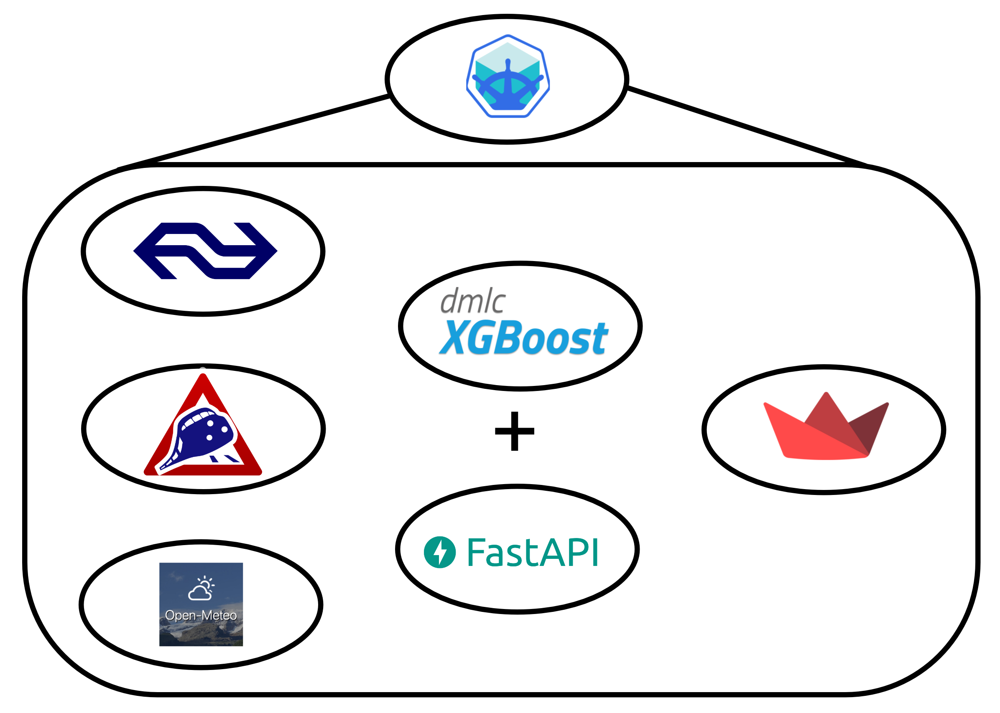
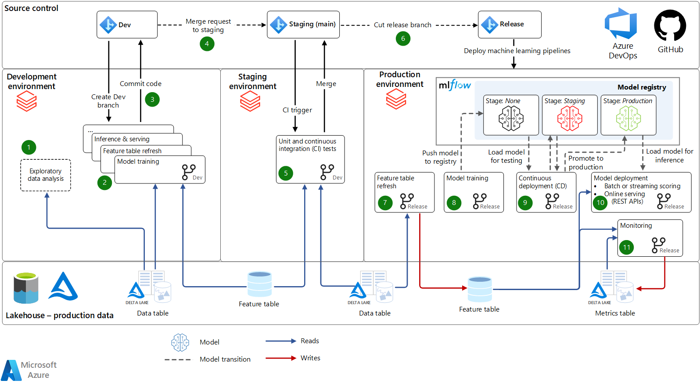

# paid-vs-opensource
A project used to compare open source vs paid technologies when using weather data to predict train disruptions.

## TODO list
- Choose hosting platform
    - Azure has been chosen as the hosting platform
- Terraform deployment
    - Kubernetes + Apache Airflow
    - Databricks Workspace

## Pipeline Architecture (Kubernetes)

## Pipeline Architecture (Databricks)

## Installation and Usage (python)
- Clone the repository
    - `git clone git@github.com:cinqict/paid-vs-opensource.git`
- Install dependencies
    - `pip install -r requirements.txt`
- Run the app
    - `streamlit run app.py`

## Installation and Usage (docker)
- Clone the repository
    - `git clone git@github.com:cinqict/paid-vs-opensource.git`
- Build the docker image
    - `docker compose --env-file=./.streamlit/secrets.toml build`
- Run the docker image
    - `docker run -p 8080:8080 weather-dash-i`

## Minikube setup and dashboard deployment
- Install minikube
    - `brew install minikube`
- `minikube start`
- `minikube dashboard` (optional) needs to be run in a separate terminal
- create a pod from the above docker image
  - `eval $(minikube docker-env)` set the docker environment to minikube
  - `docker compose --env-file=./.streamlit/secrets.toml build`
  - `docker run -p 8080:8080 weather-dash-i`
  - `kubectl run weather-dash --image=weather-dash-i --image-pull-policy=Never`
  - `kubectl get pods` check the pod is running
- expose the pod as a service
  - `kubectl expose pod weather-dash --type=LoadBalancer --port=8080`
  - `kubectl get services` check the service is running
- `minikube service weather-dash`

## Minikube MySQL setup and deployment
- `minikube start`
- `kubectl create -f kubectl_deploy/mysql-pv.yaml` create the persistent volume
- `kubectl create -f kubectl_deploy/mysql-deployment.yaml` create the deployment
- `kubectl describe deployment mysql` check the deployment is running
- `kubectl get pods -l app=mysql` check the pod is running
- `kubectl describe pvc mysql-pv-claim` check the persistent volume claim is running
- `kubectl run -it --rm --image=mysql:5.6 --restart=Never mysql-client -- mysql -h mysql -ppassword` connect to the mysql pod
- `STATUS; SHOW DATABASES;` check the status and what databases are running
- `SELECT table_name FROM information_schema.tables;` check the available tables
- exit with `ctrl + c`
- `kubectl expose pod mysql-79c4686d65-74k5p --type=LoadBalancer --port=3306` expose the pod as a service
- `kubectl get services` check the service is running
